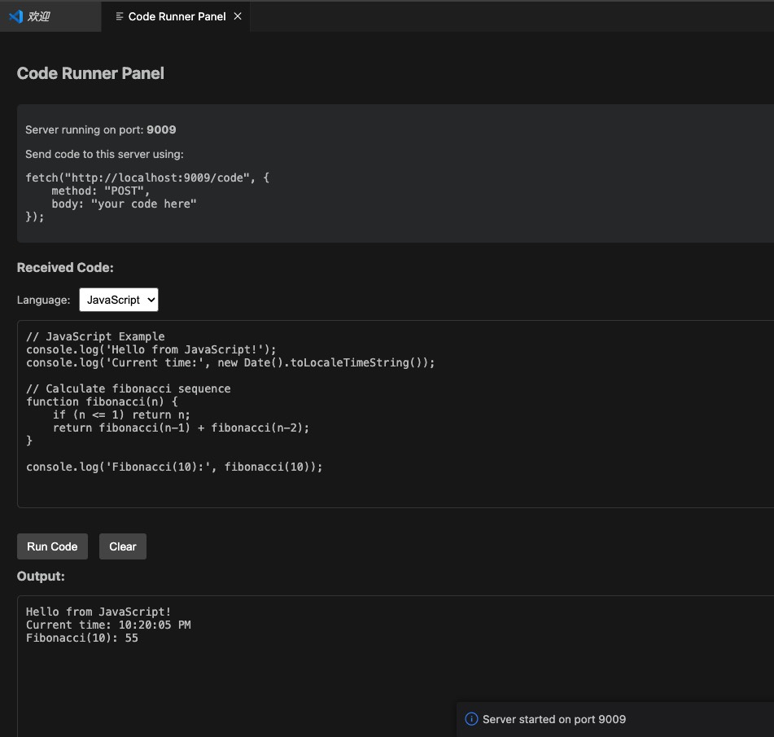
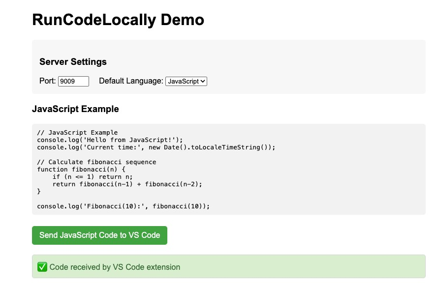

# RunCodeLocally (本地运行代码)

RunCodeLocally 是一个 VS Code 扩展，允许您接收并运行来自网页的代码。它会创建一个本地 HTTP 服务器，监听从网页发送的代码片段，在 VS Code 面板中显示它们，并让您直接在 VS Code 中运行代码。

## 功能展示

启动代码接收服务器后，您可以在 VS Code 中看到代码运行面板：



从网页发送代码到 VS Code：



## 功能

- 启动本地 HTTP 服务器以接收来自网页的代码
- 可配置的服务器端口（默认：9009）
- 在专用的 VS Code 面板中显示接收到的代码
- 运行 JavaScript 代码并查看输出
- 为网页提供简单的 API 以将代码发送到 VS Code

## 工作原理

1. 在 VS Code 中使用命令面板启动服务器
2. 扩展在配置的端口上创建一个本地 HTTP 服务器
3. 网页可以使用简单的 fetch 请求将代码发送到服务器
4. 代码会出现在 VS Code 面板中，您可以在其中运行它

## 安装

现已发布上线，插件搜索 `runcodelocally` 即可下载安装。

alpha 版本：

1. 下载扩展 VSIX 文件
2. 在 VS Code 中，转到扩展视图 (Ctrl+Shift+X)
3. 点击“...”菜单并选择“从 VSIX 安装...”
4. 选择下载的 VSIX 文件

## 使用方法

### 启动服务器

1. 打开命令面板 (Ctrl+Shift+P)
2. 输入“Start Code Receiver Server”（启动代码接收服务器）并选择该命令
3. 将打开一个面板，显示服务器状态和端口

### 从网页发送代码

使用 fetch 请求将代码发送到 VS Code。支持以下几种方式：

**方法 1：发送纯文本代码（默认为 JavaScript）**

将代码作为纯文本发送到 `/code` 端点。

```javascript
fetch('http://localhost:9009/code', {
  method: 'POST',
  headers: {
    'Content-Type': 'text/plain', // 或其他非 application/json 的类型
  },
  body: "console.log('来自网页的你好！');",
})
  .then((response) => response.text())
  .then((data) => console.log(data))
  .catch((error) => console.error('错误:', error));
```

**方法 2：发送 URL 编码的代码和语言**

将包含 `lang` 和 `code` 参数的 URL 编码字符串发送到 `/code` 端点。

```javascript
const language = 'python';
const code = 'print("来自网页的你好！")';
const encodedBody = `lang=${encodeURIComponent(language)}&code=${encodeURIComponent(code)}`;

fetch('http://localhost:9009/code', {
  method: 'POST',
  headers: {
    'Content-Type': 'application/x-www-form-urlencoded', // 或其他非 application/json 的类型
  },
  body: encodedBody,
})
  .then((response) => response.text())
  .then((data) => console.log(data))
  .catch((error) => console.error('错误:', error));
```

**方法 3：发送包含代码和语言的 JSON**

将包含 `code` 和 `language` 属性的 JSON 对象发送到 `/code-with-language` 端点。

```javascript
fetch('http://localhost:9009/code-with-language', {
  method: 'POST',
  headers: {
    'Content-Type': 'application/json',
  },
  body: JSON.stringify({
    language: 'javascript',
    code: "console.log('来自网页的 JSON 你好！');",
  }),
})
  .then((response) => response.text())
  .then((data) => console.log(data))
  .catch((error) => console.error('错误:', error));
```

### 运行代码

当代码出现在 VS Code 面板中时，点击“运行代码”按钮执行它并查看输出。

## 扩展设置

此扩展提供以下设置：

- `runcodelocally.port`：本地 HTTP 服务器的端口号（默认：9009）

## 示例 HTML 页面

`examples` 文件夹中包含一个示例 HTML 页面。在浏览器中打开 `examples/demo.html` 以测试向 VS Code 发送代码。

## 要求

- VS Code 1.99.0 或更高版本
- Node.js 运行时（用于运行 JavaScript 代码）

## 已知问题

- 目前仅支持运行 JavaScript 代码
- 如果在设置中更改了端口，需要手动重新启动服务器

## 未来增强

- 支持多种编程语言
- 面板中的代码高亮
- 将接收到的代码保存为文件
- 接收到的代码片段历史记录

## 发行说明

### 0.0.1

RunCodeLocally 的初始版本

---

## 开发者信息

### 构建扩展

1. 克隆仓库
2. 运行 `yarn install` 安装依赖项
3. 运行 `yarn run compile` 构建扩展
4. 按 F5 开始调试

### 项目结构

- `src/extension.ts`：主扩展入口点
- `src/server.ts`：HTTP 服务器实现
- `src/webview.ts`：VS Code webview 面板实现
- `examples/demo.html`：用于测试的示例 HTML 页面

### playground

```html
<!DOCTYPE html>
<html lang="en">
  <head>
    <meta charset="UTF-8" />
    <meta name="viewport" content="width=device-width, initial-scale=1.0" />
    <title>RunCodeLocally Demo</title>
    <style>
      body {
        font-family: Arial, sans-serif;
        max-width: 800px;
        margin: 0 auto;
        padding: 20px;
      }
      pre {
        background-color: #f5f5f5;
        padding: 10px;
        border-radius: 5px;
        overflow: auto;
      }
      button {
        background-color: #4caf50;
        color: white;
        border: none;
        padding: 10px 15px;
        text-align: center;
        text-decoration: none;
        display: inline-block;
        font-size: 16px;
        margin: 10px 0;
        cursor: pointer;
        border-radius: 5px;
      }
      button:hover {
        background-color: #45a049;
      }
      .settings {
        margin: 20px 0;
        padding: 15px;
        background-color: #f9f9f9;
        border-radius: 5px;
      }
      .code-container {
        margin: 20px 0;
      }
      .result {
        margin-top: 10px;
        padding: 10px;
        border: 1px solid #ddd;
        border-radius: 5px;
        display: none;
      }
      .success {
        background-color: #dff0d8;
        color: #3c763d;
      }
      .error {
        background-color: #f2dede;
        color: #a94442;
      }
    </style>
  </head>
  <body>
    <h1>RunCodeLocally Demo</h1>

    <div class="settings">
      <h3>Server Settings</h3>
      <div style="display: flex; align-items: center; gap: 20px">
        <div>
          <label for="portInput">Port:</label>
          <input
            type="number"
            id="portInput"
            value="9009"
            min="1024"
            max="65535"
          />
        </div>
        <div>
          <label for="languageSelect">Default Language:</label>
          <select id="languageSelect">
            <option value="javascript">JavaScript</option>
            <option value="typescript">TypeScript</option>
            <option value="dart">Dart</option>
            <option value="python">Python</option>
            <option value="ruby">Ruby</option>
            <option value="go">Go</option>
            <option value="php">PHP</option>
            <option value="rust">Rust</option>
          </select>
        </div>
      </div>
    </div>

    <div class="code-container">
      <h3>JavaScript Example</h3>
      <pre id="jsCode">
// JavaScript Example
console.log('Hello from JavaScript!');
console.log('Current time:', new Date().toLocaleTimeString());

// Calculate fibonacci sequence
function fibonacci(n) {
    if (n <= 1) return n;
    return fibonacci(n-1) + fibonacci(n-2);
}

console.log('Fibonacci(10):', fibonacci(10));</pre
      >

      <button onclick="sendCode('js')">Send JavaScript Code to VS Code</button>
      <div id="jsResult" class="result"></div>
    </div>

    <div class="code-container">
      <h3>Dart Example</h3>
      <pre id="dartCode">
// Dart Example
void main() {
  print('Hello from Dart!');
  print('Current time: ${DateTime.now().toString()}');

  // Calculate fibonacci sequence
  print('Fibonacci(10): ${fibonacci(10)}');
}

int fibonacci(int n) {
  if (n <= 1) return n;
  return fibonacci(n-1) + fibonacci(n-2);
}</pre
      >

      <button onclick="sendCode('dart')">Send Dart Code to VS Code</button>
      <div id="dartResult" class="result"></div>
    </div>

    <div class="code-container">
      <h3>Python Example</h3>
      <pre id="pythonCode">
# Python Example
import datetime

print('Hello from Python!')
print('Current time:', datetime.datetime.now())

# Calculate fibonacci sequence
def fibonacci(n):
    if n <= 1:
        return n
    return fibonacci(n-1) + fibonacci(n-2)

print('Fibonacci(10):', fibonacci(10))</pre
      >

      <button onclick="sendCode('python')">Send Python Code to VS Code</button>
      <div id="pythonResult" class="result"></div>
    </div>

    <div class="code-container">
      <h3>Custom Code</h3>
      <textarea id="customCode" rows="10" style="width: 100%">
// Write your code here
console.log('Hello, world!');</textarea
      >

      <button onclick="sendCustomCode()">Send Custom Code to VS Code</button>
      <div id="customResult" class="result"></div>
    </div>

    <script>
      function sendCode(type) {
        const port = document.getElementById("portInput").value;
        let code;
        let language;
        let resultElement;

        if (type === "js") {
          code = document.getElementById("jsCode").textContent;
          resultElement = document.getElementById("jsResult");
          language = "javascript";
        } else if (type === "dart") {
          code = document.getElementById("dartCode").textContent;
          resultElement = document.getElementById("dartResult");
          language = "dart";
        } else if (type === "python") {
          code = document.getElementById("pythonCode").textContent;
          resultElement = document.getElementById("pythonResult");
          language = "python";
        }

        sendToVSCode(code, language, port, resultElement);
      }

      function sendCustomCode() {
        const port = document.getElementById("portInput").value;
        const code = document.getElementById("customCode").value;
        const language = document.getElementById("languageSelect").value;
        const resultElement = document.getElementById("customResult");

        sendToVSCode(code, language, port, resultElement);
      }

      function sendToVSCode(code, language, port, resultElement) {
        resultElement.style.display = "block";
        resultElement.textContent = "Sending code...";
        resultElement.className = "result";

        // Create URL-encoded payload with code and language

        const encodedCode = encodeURIComponent(code);
        const encodedLanguage = encodeURIComponent(language);

        // Use form URL-encoded format
        const formData = new FormData();
        formData.append("code", code);
        formData.append("language", language);

        fetch(`http://localhost:${port}/code-with-language`, {
          method: "POST",
          body: JSON.stringify({
            code: encodedCode,
            language: encodedLanguage,
          }),
          headers: {
            "Content-Type": "application/json",
          },
        })
          .then((response) => response.text())
          .then((data) => {
            resultElement.textContent = data;
            resultElement.className = "result success";
          })
          .catch((error) => {
            // Fallback to old endpoint if new one fails
            // Use URL-encoded string format for the /code endpoint
            const urlEncodedPayload = `lang=${encodedLanguage}&code=${encodedCode}`;

            fetch(`http://localhost:${port}/code`, {
              method: "POST",
              body: urlEncodedPayload,
            })
              .then((response) => response.text())
              .then((data) => {
                resultElement.textContent = data;
                resultElement.className = "result success";
              })
              .catch((innerError) => {
                resultElement.textContent = `Error: ${error.message}. Make sure the VS Code extension is running.`;
                resultElement.className = "result error";
              });
          });
      }
    </script>
  </body>
</html>
```

**祝您使用愉快！**
